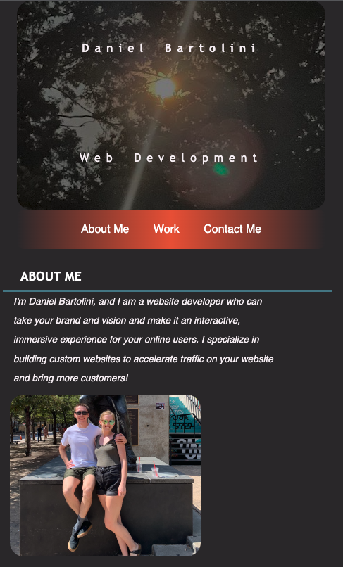

# Portfolio

This Portfolio project is a website I created to showcase my work and give potential future clients a place to learn a little more. Naturally, ones portfolio is always a work in progress; as such, this website will be updated regularly.

## Table of Contents
- [Description](#description)
- [Visuals](#visuals)
- [Support](#support)

## Description
This Portfolio gives potential clients a place to see my previous work, with easy-to-access image links to each project. I wanted the visual layout of the website to allow users to easily find the section they want to navigate to. Additionally, I wanted the layout to be adaptive to different screen sizes. My previous work is showcased in the Work section, where hovering over each image will increase its opacity. At the bottom, you can find my phone number and hyperlinks to my GitHub and LinkedIn profiles. This wesite will be updated periodically pending any future work.

## Visuals

## Support

If you find an issue with this website or need support, please reach out! My professional email is djb3149@gmail.com
